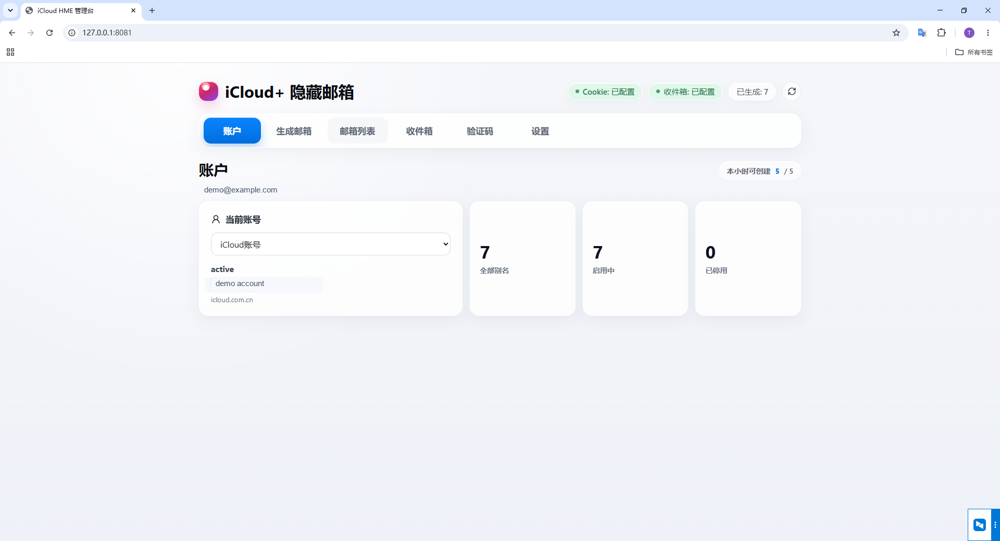
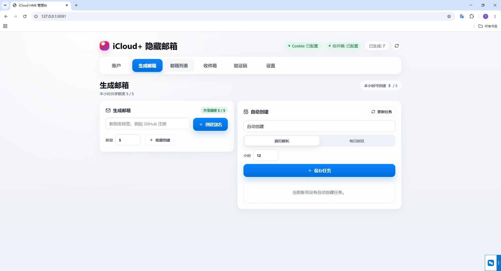
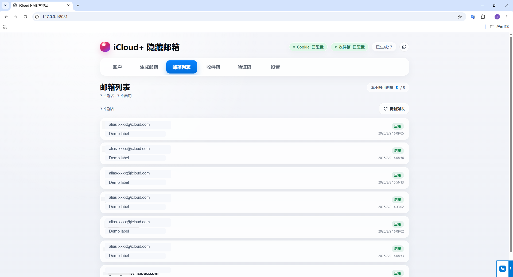
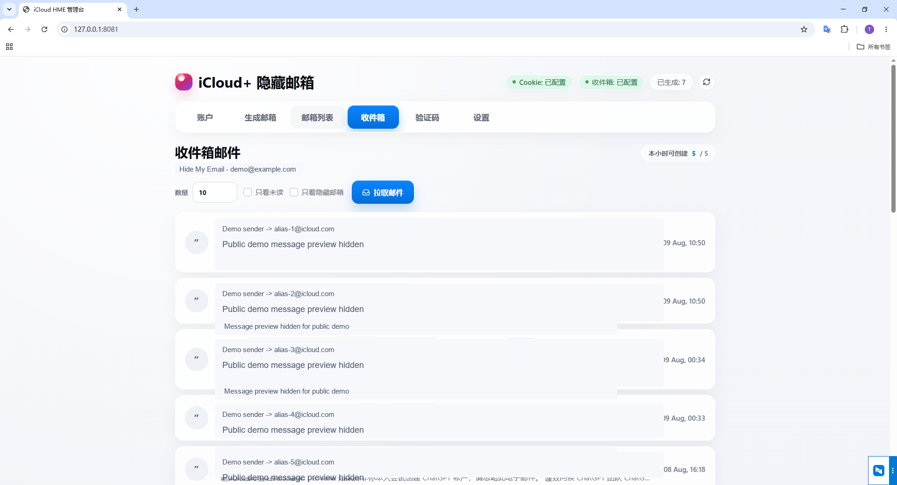
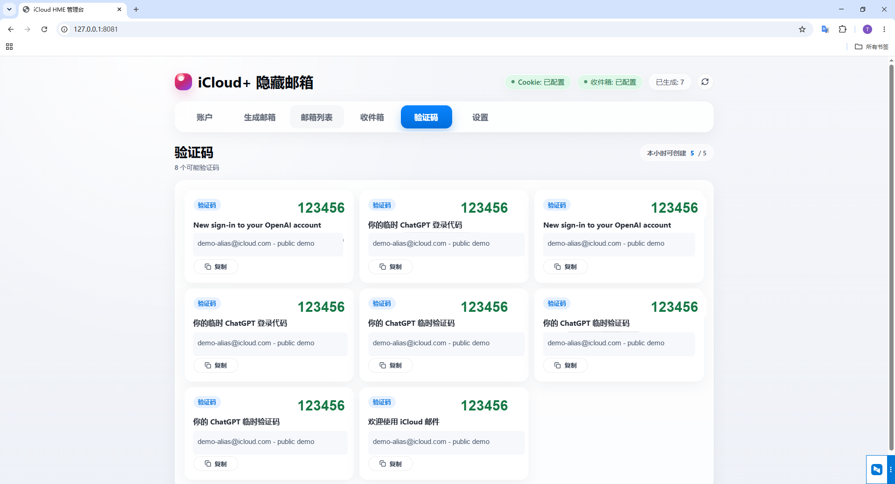
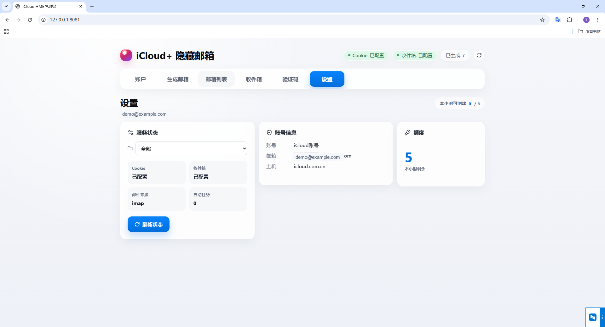

# iCloud Prime

[](https://github.com/forever94yu/icloud-prime/actions/workflows/ci.yml)
[](https://github.com/forever94yu/icloud-prime/releases)
[](LICENSE)

iCloud Prime is a local, self-hosted management console for Apple iCloud Hide My Email aliases.
It provides a web UI and HTTP API for managing multiple iCloud accounts, creating aliases,
listing aliases, and reading mail sent to aliases.

Repository: <https://github.com/forever94yu/icloud-prime>

## Project Status

This project is public and open to community contributions.

- Issues are enabled for bug reports, feature requests, questions, and documentation feedback.
- Pull requests are welcome from forks.
- Discussions are enabled for usage help and roadmap conversations.
- CI runs on pushes and pull requests.
- Releases include a Windows 10 portable package with placeholder-only configuration.

## Security First

Never commit real account data.

The following files and directories must stay local:

- `data/accounts.json`
- `data/create_jobs.json`
- `.env`
- `logs/`
- `build/`
- any `.exe` binary

The Windows portable release does not include real account data. It includes only
`data/accounts.example.json` with placeholder values.

Your local `data/accounts.json` may contain iCloud Cookie values, App-specific passwords,
and proxy settings. Treat it like a password file.
Your local `data/create_jobs.json` contains scheduled alias creation jobs and stays local too.

## Features

- Local web console at `http://127.0.0.1:8081`
- Multi-account management
- Create iCloud Hide My Email aliases
- Batch-create up to 5 aliases per account per hour
- Schedule automatic alias creation by duration or daily time window
- List aliases for each account
- Deactivate, reactivate, and delete aliases
- Read mail through IMAP first, with Web API Cookie fallback
- Click inbox messages to open a centered detail modal instead of scrolling to the bottom
- Lazy-load and cache full message bodies for faster repeated mail-detail viewing
- Support for `icloud.com` and `icloud.com.cn`
- Optional HTTP/SOCKS5 proxy settings
- Windows 10 portable release package

## Screenshots

The screenshots below use public demo values only. Real account data, aliases,
verification codes, and message previews are not included.

### Account Overview



### Alias Creation



### Alias List



### Inbox



### Verification Codes



### Settings



## Quick Start: Windows 10 Portable Package

This is the easiest way to run the project. You do not need Go or Node.js.

### 1. Download

Open the Releases page:

<https://github.com/forever94yu/icloud-prime/releases>

Download:

```text
icloud-prime-windows10-portable-v0.1.4.zip
```

### 2. Extract

Extract the zip to a stable folder, for example:

```text
D:\Tools\icloud-prime
```

The extracted folder contains:

```text
icloud-prime-windows10-portable-v0.1.4/
|-- icloud-prime.exe
|-- start.bat
|-- stop.bat
|-- README-Usage.txt
|-- data/
|   `-- accounts.example.json
`-- logs/
```

### 3. Start

Double-click:

```text
start.bat
```

Then open:

<http://127.0.0.1:8081>

Manual start:

```powershell
.\icloud-prime.exe -addr :8081 -data .\data
```

### 4. Add an Account

In the web console:

1. Open the account area.
2. Add a display name such as `Main account`.
3. Use `icloud.com` for most accounts.
4. Use `icloud.com.cn` for China-region iCloud accounts.
5. Add Cookie values now, or add the account first and update Cookie values later.

Runtime account data is stored in:

```text
data/accounts.json
```

Do not upload or share that file.

### 5. Configure Cookie Values

Cookie authentication is used for Hide My Email alias management and as a Web API mail fallback.

Common browser workflow:

1. Open <https://www.icloud.com> or <https://www.icloud.com.cn>.
2. Log in to your iCloud account.
3. Open browser developer tools.
4. Open Application or Storage.
5. Find Cookies for iCloud.
6. Copy the relevant iCloud Cookie values.
7. Paste them into the web console account form.

Accepted Cookie input formats:

```text
X-APPLE-WEBAUTH-TOKEN=value; X-APPLE-WEBAUTH-USER=value; X-APPLE-DS-WEB-SESSION-TOKEN=value
```

or:

```json
{
  "X-APPLE-WEBAUTH-TOKEN": "value",
  "X-APPLE-WEBAUTH-USER": "value",
  "X-APPLE-DS-WEB-SESSION-TOKEN": "value"
}
```

If alias creation returns `401` or `403`, refresh your Cookie values.

### 6. Configure an App-Specific Password

An App-specific password is used for IMAP mail reading. It is not your Apple ID password.

1. Open <https://appleid.apple.com>.
2. Log in.
3. Open "Sign-In and Security".
4. Create an App-specific password.
5. Save your iCloud email address and App-specific password in the web console.

Example:

```json
{
  "icloud_email": "your_email@icloud.com",
  "app_password": "xxxx-xxxx-xxxx-xxxx"
}
```

### 7. Create a Hide My Email Alias

In the web console:

1. Select an account.
2. Enter a label such as `Example site`.
3. Click create.
4. Copy the generated alias.

API example:

```bash
curl -X POST http://127.0.0.1:8081/api/create \
  -H "Content-Type: application/json" \
  -d "{\"account_id\":\"acc_1\",\"label\":\"Example site\"}"
```

### 8. Batch Create Aliases

Batch creation shares the same hourly quota as single creation and automatic jobs.
Each account can successfully create up to 5 aliases per hour.

In the web console:

1. Select an account.
2. Open the batch creation area.
3. Choose a count from `1` to `5`.
4. Enter a label prefix such as `Signup`.
5. Start the batch creation.
6. Review the created aliases, skipped count, and remaining hourly quota.

API example:

```bash
curl -X POST http://127.0.0.1:8081/api/create/batch \
  -H "Content-Type: application/json" \
  -d "{\"account_id\":\"acc_1\",\"count\":5,\"label_prefix\":\"Signup\"}"
```

### 9. Schedule Automatic Alias Creation

Automatic jobs are stored locally in:

```text
data/create_jobs.json
```

Do not upload or share that file.

Duration-based job:

1. Select an account.
2. Open the automatic creation area.
3. Choose `duration`.
4. Enter a duration in hours, for example `12`.
5. Enter a label prefix.
6. Save the job.
7. Use pause, resume, or delete when needed.

Daily-window job:

1. Select an account.
2. Choose `daily_window`.
3. Enter `start_time` and `end_time` in `HH:mm` format.
4. Use a cross-midnight range when needed, for example `22:00` to `02:00`.
5. Save the job.

API examples:

```bash
curl -X POST http://127.0.0.1:8081/api/create/jobs \
  -H "Content-Type: application/json" \
  -d "{\"account_id\":\"acc_1\",\"mode\":\"duration\",\"duration_hours\":12,\"label_prefix\":\"Auto\"}"

curl -X POST http://127.0.0.1:8081/api/create/jobs \
  -H "Content-Type: application/json" \
  -d "{\"account_id\":\"acc_1\",\"mode\":\"daily_window\",\"start_time\":\"09:00\",\"end_time\":\"18:00\",\"label_prefix\":\"Workday\"}"

curl "http://127.0.0.1:8081/api/create/jobs?account_id=acc_1"
```

### 10. Read Mail

In the web console, select an account and alias.
Click a message row to open the full mail details in a modal window. The modal
shows the subject, sender, recipient, time, detected verification code, and body
preview without forcing you to scroll to the bottom of the page.
The app now loads full message bodies on demand and prefetches visible messages
in the background, so verification-code extraction and repeated detail views are
faster after the first read.

API example:

```bash
curl "http://127.0.0.1:8081/api/inbox?account_id=acc_1&alias=alias@icloud.com&limit=20&days=7"
```

Read order:

1. IMAP through App-specific password.
2. Web API through Cookie fallback.

### 11. Stop

Double-click:

```text
stop.bat
```

Or run:

```powershell
taskkill /F /IM icloud-prime.exe
```

## Build From Source

### 1. Requirements

- Git
- Go 1.26 or newer
- Node.js 20 or newer if you need to rebuild the web UI

### 2. Clone

```bash
git clone https://github.com/forever94yu/icloud-prime.git
cd icloud-prime
```

### 3. Download Go Dependencies

```bash
go mod download
```

### 4. Rebuild the Web UI

Only needed when changing files under `web/`.

```bash
cd web
npm ci
npm run build
cd ..
```

The Vite build writes static files to:

```text
internal/server/static/dist
```

The Go binary embeds that directory.

### 5. Build

```bash
go build -ldflags="-s -w" -o icloud-prime.exe .
```

### 6. Run

```bash
.\icloud-prime.exe -addr :8081 -data .\data
```

Open:

<http://127.0.0.1:8081>

## Command-Line Options

```bash
.\icloud-prime.exe
```

Uses `:8081` and `.\data`.

```bash
.\icloud-prime.exe -addr :9000
```

Uses port `9000`.

```bash
.\icloud-prime.exe -data D:\icloud-prime-data
```

Uses a custom data directory.

```bash
.\icloud-prime.exe -debug
```

Enables debug logging.

## API Summary

Account management:

```text
GET    /api/accounts
POST   /api/accounts
DELETE /api/accounts/:id
POST   /api/accounts/:id/password
PUT    /api/accounts/:id/cookies
POST   /api/accounts/:id/login
```

Alias management:

```text
POST   /api/create
POST   /api/create/batch
GET    /api/create/jobs?account_id=acc_1
POST   /api/create/jobs
POST   /api/create/jobs/:id/pause
POST   /api/create/jobs/:id/resume
DELETE /api/create/jobs/:id
GET    /api/aliases?account_id=acc_1
POST   /api/aliases/:id/deactivate
POST   /api/aliases/:id/reactivate
DELETE /api/aliases/:id
```

Mail:

```text
GET /api/inbox?account_id=acc_1&alias=alias@icloud.com&limit=20&days=7
GET /api/messages/:id?account_id=acc_1&folder=INBOX
POST /api/messages
GET /api/mailboxes?account_id=acc_1
```

See [API.md](API.md) for more detail.

## Contributing

Contributions are welcome.

Good first contributions:

- Improve documentation
- Add tests around account file parsing
- Improve error messages
- Improve Windows packaging
- Add screenshots or setup guides
- Report iCloud region compatibility issues

Before opening a PR, read [CONTRIBUTING.md](CONTRIBUTING.md).

## Maintainer Workflow

The project is maintained through normal open-source workflows:

- Issues for bug reports and feature requests
- Pull requests for code and documentation changes
- GitHub Actions CI for validation
- Tagged releases for downloadable builds
- Security policy for responsible disclosure

This setup is intended to make the project easier to maintain with Codex-assisted
triage, review, release, and documentation workflows.

## License

MIT. See [LICENSE](LICENSE).
